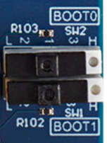

# x-cube-n6-ai-face-landmarks Application

Computer Vision application demonstrating the deployment of several object detection models execution in series on the STM32N6570-DK or NUCLEO-N657X0-Q board. The chosen use case is multiple-faces landmark detection. It consists of two models that execute sequentially:

1. A face detection (fd) model is executed in the first stage to detect the faces.
2. A face landmark (fl) detection model is executed in the second stage to identify the landmarks of the faces detected during the first stage. After the execution of the first model, a resize operation takes place to provide the expected input to the second model.
   On STM32N6570-DK GPU2D is used to also perform a rotation to orient face vertically.

This top README gives an overview of the app. Additional documentation is available in the [Doc](./Doc/) folder.


---

## Doc Folder Content

- [Application Overview](Doc/Application-Overview.md)
- [Boot Overview](Doc/Boot-Overview.md)
- [Camera Build Options](Doc/Build-Options.md)

---

## Features Demonstrated

- Multi-threaded application flow (FreeRTOS)
- NPU-accelerated quantized AI model inference
- GPU2D usage to perform resize and rotation
- Execute multiple models in series
- Dual DCMIPP pipelines
- DCMIPP cropping, decimation, and downscaling
- DCMIPP ISP usage
- LTDC dual-layer implementation
- Development mode
- Boot from external flash

---

## Hardware Support

Supported development platforms:

- [STM32N6570-DK](https://www.st.com/en/evaluation-tools/stm32n6570-dk.html) Discovery Board
  - Connect to the onboard ST-LINK debug adapter (CN6) using a __USB-C to USB-C cable__ for sufficient power.
  - OTP fuses are configured for xSPI IOs to achieve maximum speed (200MHz) on xSPI interfaces.
- [NUCLEO-N657X0-Q](https://www.st.com/en/evaluation-tools/nucleo-n657x0-q.html) Nucleo Board
  - Connect to the onboard ST-LINK debug adapter (CN9) using a __USB-C to USB-C cable__ for sufficient power.
  - OTP fuses are configured for xSPI IOs to achieve maximum speed (200MHz) on xSPI interfaces.


STM32N6570-DK board with MB1854B IMX335.

Supported camera modules:

- Provided IMX335 camera module
- [STEVAL-55G1MBI](https://www.st.com/en/evaluation-tools/steval-55g1mbi.html)
- [STEVAL-66GYMAI1](https://www.st.com/en/evaluation-tools/steval-66gymai.html)

For the Nucleo board, one of the following displays is required:

- A USB host for data transmission via USB/UVC (using the USB OTG port CN8)


NUCLEO-N657X0-Q board with USB/UVC display.

- [X-NUCLEO-GFX01M2](https://www.st.com/en/evaluation-tools/x-nucleo-gfx01m2.html) SPI display


NUCLEO-N657X0-Q board with SPI display.

---

## Tools Version

- IAR Embedded Workbench for Arm (**EWARM 9.40.1**) + N6 patch ([**EWARMv9_STM32N6xx_V1.0.0**](STM32Cube_FW_N6/Utilities/PC_Software/EWARMv9_STM32N6xx_V1.0.0.zip))
- [STM32CubeIDE](https://www.st.com/content/st_com/en/products/development-tools/software-development-tools/stm32-software-development-tools/stm32-ides/stm32cubeide.html) (__v1.17.0__)
- [STM32CubeProgrammer](https://www.st.com/en/development-tools/stm32cubeprog.html) (__v2.18.0__)
- [STEdgeAI](https://www.st.com/en/development-tools/stedgeai-core.html) (__v2.2.0__)

---

## Boot Modes

The STM32N6 series does not have internal flash memory. To retain firmware after a reboot, program it into the external flash. Alternatively, you can load firmware directly into SRAM (development mode), but note that the program will be lost if the board is powered off in this mode.

Development Mode: used for loading firmware into RAM during a debug session or for programming firmware into external flash.

Boot from Flash: used to boot firmware from external flash.

|                  | STM32N6570-DK                                                                | NUCLEO-N657X0-Q                                                                  |
| -------------    | -------------                                                                |-----------------                                                                 |
| Boot from flash  |  |  |
| Development mode |        |        |

---

## Console parameters

You can see application messages by attaching a console application to the ST-Link console output. Use the following console parameters:
- Baud rate of 115200 bps.
- No parity.
- One stop bit.

---

## Quickstart using Prebuilt Binaries

### STM32N6570-DK

To program the board's external flash, follow these steps:

1. Set the board to [development mode](#boot-modes).
2. Program `Binary/ai_fsbl.hex` (First Stage Boot Loader).
3. Program `Binary/face_detector_data.hex` (parameters of the face detector model).
4. Program `Binary/face_landmark_data.hex` (parameters of the face landmarks model).
5. Program `Binary/x-cube-n6-ai-face-landmarks-dk.hex` (firmware application).
6. Set the board to [boot from flash mode](#boot-modes).
7. Power cycle the board.

__Note__: The `Binary/x-cube-n6-ai-face-landmarks-dk.hex` firmware is built for MB1939 STM32N6570-DK REV C02 with any of the listed camera modules.

### NUCLEO-N657X0-Q

#### USB/UVC Display

To program the board's external flash, follow these steps:

1. Set the board to [development mode](#boot-modes).
2. Program `Binary/ai_fsbl.hex` (First Stage Boot Loader).
3. Program `Binary/face_detector_data.hex` (parameters of the face detector model).
4. Program `Binary/face_landmark_data.hex` (parameters of the face landmarks model).
5. Program `Binary/x-cube-n6-ai-face-landmarks-nucleo-uvc.hex` (firmware application).
6. Set the board to [boot from flash mode](#boot-modes).
7. Connect a USB cable to the USB OTG port (CN8), next to the RJ45 port. Connect the other end to a USB host (PC, USB hub, etc.) for data transmission via USB/UVC.
8. Power cycle the board.
9. Start the camera application on the host. On Windows, search for "camera" in the Start menu.

__Note__: The `Binary/x-cube-n6-ai-face-landmarks-nucleo-uvc.hex` firmware is built for MB1940 NUCLEO-N657X0-Q REV C01 with USB/UVC host display and any of the listed camera modules.

#### SPI Display

To program the board's external flash, follow these steps:

1. Set the board to [development mode](#boot-modes).
2. Program `Binary/ai_fsbl.hex` (First Stage Boot Loader).
3. Program `Binary/face_detector_data.hex` (parameters of the face detector model).
4. Program `Binary/face_landmark_data.hex` (parameters of the face landmarks model).
5. Program `Binary/x-cube-n6-ai-face-landmarks-nucleo-spi.hex` (firmware application).
6. Set the board to [boot from flash mode](#boot-modes).
7. Put the X-NUCLEO-GFX01M2 shield on top of the NUCLEO-N657X0-Q board.
8. Power cycle the board.

__Note__: The `Binary/x-cube-n6-ai-face-landmarks-nucleo-spi.hex` firmware is built for MB1940 NUCLEO-N657X0-Q REV C01 with X-NUCLEO-GFX01M2 SPI display and any of the listed camera modules.

---

### How to Program Hex Files Using STM32CubeProgrammer UI

See [How to program hex files STM32CubeProgrammer](Doc/Program-Hex-Files-STM32CubeProgrammer.md).

---

### How to Program Hex Files on STM32N6570-DK Using Command Line

Ensure the STM32CubeProgrammer `bin` folder is in your PATH.

```bash
export DKEL="<STM32CubeProgrammer_N6 Install Folder>/bin/ExternalLoader/MX66UW1G45G_STM32N6570-DK.stldr"

# First Stage Boot Loader
STM32_Programmer_CLI -c port=SWD mode=HOTPLUG -el $DKEL -hardRst -w Binary/ai_fsbl.hex

# Network parameters and biases
STM32_Programmer_CLI -c port=SWD mode=HOTPLUG -el $DKEL -hardRst -w Binary/face_detector_data.hex
STM32_Programmer_CLI -c port=SWD mode=HOTPLUG -el $DKEL -hardRst -w Binary/face_landmark_data.hex

# Application Firmware
STM32_Programmer_CLI -c port=SWD mode=HOTPLUG -el $DKEL -hardRst -w Binary/x-cube-n6-ai-face-landmarks-dk.hex
```

---

### How to Program Hex Files on NUCLEO-N657X0-Q Using Command Line

Ensure the STM32CubeProgrammer `bin` folder is in your PATH.

```bash
export NUEL="<STM32CubeProgrammer_N6 Install Folder>/bin/ExternalLoader/MX25UM51245G_STM32N6570-NUCLEO.stldr"

# First Stage Boot Loader
STM32_Programmer_CLI -c port=SWD mode=HOTPLUG -el $NUEL -hardRst -w Binary/ai_fsbl.hex

# Network parameters and biases
STM32_Programmer_CLI -c port=SWD mode=HOTPLUG -el $NUEL -hardRst -w Binary/face_detector_data.hex
STM32_Programmer_CLI -c port=SWD mode=HOTPLUG -el $NUEL -hardRst -w Binary/face_landmark_data.hex

# Application Firmware
# USB/UVC display
STM32_Programmer_CLI -c port=SWD mode=HOTPLUG -el $NUEL -hardRst -w Binary/x-cube-n6-ai-face-landmarks-nucleo-uvc.hex
# SPI display
STM32_Programmer_CLI -c port=SWD mode=HOTPLUG -el $NUEL -hardRst -w Binary/x-cube-n6-ai-face-landmarks-nucleo-spi.hex
```

---

## Quickstart using Source Code

Before building and running the application, you must program `face_detector_data.hex` and `face_landmark_data.hex` (model weights and biases). This only needs to be done once unless you change the AI model. See [Quickstart using prebuilt binaries](#quickstart-using-prebuilt-binaries) for details.

For more information about boot modes, see [Boot Overview](Doc/Boot-Overview.md).

---

### Application Build and Run - Dev Mode

Set your board to [development mode](#development-mode).

#### STM32CubeIDE

Double-click `STM32CubeIDE/<board_name>/.project` to open the project in STM32CubeIDE. Build and run the project.

#### IAR EWARM

Double-click `EWARM/<board_name>/x-cube-n6-ai-face-landmarks-dk.eww` to open the project in IAR. Build and run the project.

#### Makefile

Run the following commands (ensure required tools are in your PATH):

1. Build the project:
    ```bash
    make -j8
    ```
2. Start a GDB server connected to the STM32 target:
    ```bash
    ST-LINK_gdbserver -p 61234 -l 1 -d -s -cp <path-to-stm32cubeprogramer-bin-dir> -m 1 -g
    ```
3. In a separate terminal, launch a GDB session to load the firmware:
    ```bash
    $ arm-none-eabi-gdb build/Project.elf
    (gdb) target remote :61234
    (gdb) monitor reset
    (gdb) load
    (gdb) continue
    ```

__Note__: To select the board, specify `BOARD=STM32N6570-DK` or `BOARD=NUCLEO-N657X0-Q` as a Makefile option.

__Note__: To select the NUCLEO-N657X0-Q display interface, specify `SCR_LIB_SCREEN_ITF=UVCL` or `SCR_LIB_SCREEN_ITF=SPI` as a Makefile option.

---

### Application Build and Run - Boot from Flash

Set your board to [development mode](#development-mode).

#### Build the Application

##### STM32CubeIDE

Double-click `STM32CubeIDE/<board_name>/.project` to open the project in STM32CubeIDE. Build the project.

##### IAR EWARM

Double-click `EWARM/<board_name>/x-cube-n6-ai-face-landmarks-dk.eww` to open the project in IAR. Build the project.

##### Makefile

Ensure all required tools are in your PATH, then build the project:

```bash
make -j8
```

#### Program the Firmware in the External Flash

After building the application, you must add a signature to the binary file:

```bash
STM32_SigningTool_CLI -bin build/Project.bin -nk -t ssbl -hv 2.3 -o build/Project_sign.bin
```

Program the signed binary at address `0x70100000`.

On STM32N6570-DK:

```bash
export DKEL="<STM32CubeProgrammer_N6 Install Folder>/bin/ExternalLoader/MX66UW1G45G_STM32N6570-DK.stldr"

# Adjust build path as needed
STM32_Programmer_CLI -c port=SWD mode=HOTPLUG -el $DKEL -hardRst -w build/Project_sign.bin 0x70100000
```

On NUCLEO-N657X0-Q:

```bash
export NUEL="<STM32CubeProgrammer_N6 Install Folder>/bin/ExternalLoader/MX25UM51245G_STM32N6570-NUCLEO.stldr"

# Adjust build path as needed
STM32_Programmer_CLI -c port=SWD mode=HOTPLUG -el $NUEL -hardRst -w build/Project_sign.bin 0x70100000
```

__Note__: Only the application binary needs to be programmed if `fsbl` and networks data have already been programmed.

Set your board to [boot from flash](#boot-from-flash) mode and power cycle to boot from external flash.
